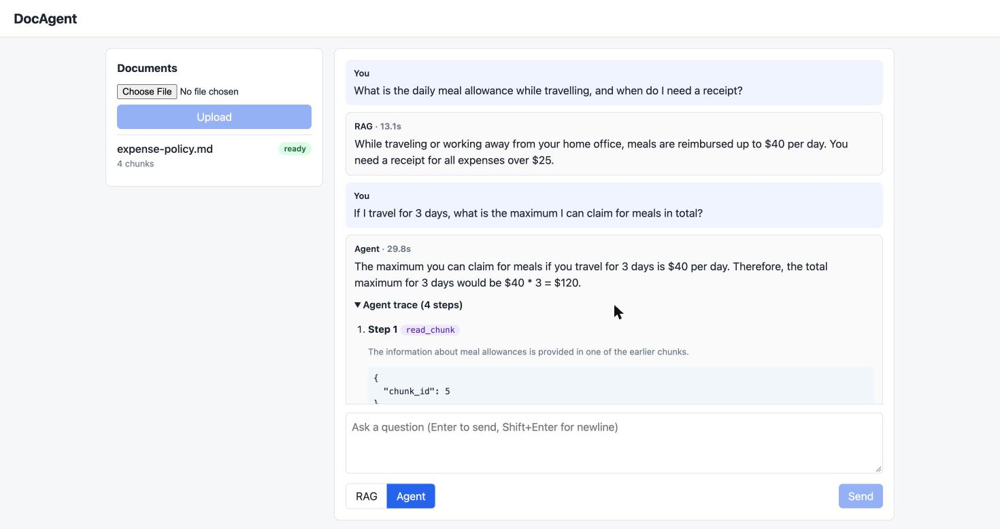

# DocAgent

A self-hosted agentic RAG assistant over your own documents. Upload PDFs or Markdown, ask questions, get cited
answers — either in one grounded pass or through a ReAct agent that searches, reads, compares and calculates
before answering. Runs entirely on a laptop with a local Hugging Face model; a hosted model is one env var away.

Everything claimed here is measured by `python -m docagent.eval` and written to [`docs/EVAL.md`](docs/EVAL.md).



```
browser ── React/TS UI (nginx) ──► FastAPI api ──► SQLite  (documents, chunks, runs, traces)
                                     │  ▲          vector index + BM25  (on disk, versioned)
                                     │  └── hybrid retrieve → cross-encoder rerank → generate / agent
                                     └── enqueue ingest job ──► Redis ──► arq worker ──► chunk → embed → index
```

## What it does

- **Ingestion** in a background worker: token-aware chunking (256 tokens, 32 overlap) with the embedding model's
  tokenizer, `BAAI/bge-small-en-v1.5` embeddings, exact vector search (FAISS on Linux, NumPy on macOS — see
  [why](docs/ARCHITECTURE.md#vector-backend)), BM25 for exact-token recall. Index files are written atomically and
  versioned, so the API picks up new documents without a restart.
- **Retrieval**: dense top-20 + BM25 top-20 fused with reciprocal rank fusion, reranked by the cross-encoder
  `ms-marco-MiniLM-L-6-v2`.
- **Grounded answers**: numbered sources, `[n]` citations parsed back to chunks, stored per run.
- **Agent**: a ReAct loop with a typed tool registry (`search_docs`, `read_chunk`, `compare`, `calculate`), a strict
  JSON tool-call parser, per-step traces, and a deterministic fallback to single-pass RAG. The agent decides *what to
  read*; the final answer is then synthesized with the grounded prompt over exactly the evidence it gathered.
- **Model**: `Qwen/Qwen2.5-1.5B-Instruct` locally (MPS/CUDA/CPU) by default; `DOCAGENT_PROVIDER=anthropic` switches
  to the Anthropic API.
- **Operations**: Prometheus metrics, Docker Compose, Kubernetes manifests verified on kind in CI, Terraform for
  AWS ECS Fargate (validated, not applied).

## Measured

40 hand-written questions over 8 synthetic handbook documents (32 chunks), local Qwen2.5-1.5B on an Apple M4.
Full tables, definitions and per-kind breakdown in [`docs/EVAL.md`](docs/EVAL.md); the first run, before the agent
redesign, is kept in [`docs/EVAL-run1-freeform-agent.md`](docs/EVAL-run1-freeform-agent.md).

| | recall@1 | recall@5 | MRR | keyword hit | citation precision | p50 latency |
|---|---|---|---|---|---|---|
| Retrieval (hybrid + rerank) | 87.5% | 100% | 0.925 | — | — | 60 ms |
| RAG, single pass | | | | 92.5% | 100% | 2.6 s |
| Agent, run 1 (free-form final answer) | | | | 47.5% | 44.5% | 11.2 s |
| Agent, run 2 (evidence gathering + grounded synthesis) | | | | **92.5%** | 50.0% | 17.1 s |

What the second run changed and why: run 1 showed the loss was in *answering*, not retrieval or tool use (95–98%
valid tool calls). The model saw 300-character previews, rarely read chunks, and wrote confident wrong sentences.
Now search results carry the chunk text, and `final_answer` triggers synthesis over the gathered chunks (up to 8,
cited ones first). Lookups went from 46.7% to 100%; arithmetic questions went from 25% to 50% — the 1.5B model still
mis-multiplies after calculating. In run 2 the agent fell back to single-pass RAG on 20% of questions (8 of 40, all
8 answered correctly by the fallback); the agent's own synthesized answers scored 29 of 32. Agent citation precision
is lower than RAG's because the synthesis cites every evidence chunk it used, not only the gold one; the metric is
reported as is.

## Quickstart

```sh
uv venv --python 3.12 .venv && source .venv/bin/activate
uv pip install -r requirements.txt -e .
python -m pytest -q                      # ~90 tests, fakes for every model, under 10 s

docker compose up --build -d --wait      # redis + api + worker + ui; first start downloads models
open http://localhost:8080               # upload eval/corpus/expense-policy.md, ask "what is the meal limit?"
python scripts/wait_and_smoke.py         # upload → index → cited answer, used by CI too
```

Without Docker: run Redis, then `uvicorn docagent.api.main:app` and `arq docagent.worker.main.WorkerSettings`.

Reproduce the evaluation: `python -m docagent.eval` (about 25 minutes on an M4; `--provider fake --limit 5` checks
the pipeline in seconds).

## API

| Method | Path | Purpose |
|---|---|---|
| `POST` | `/documents` | multipart upload (`.pdf`, `.md`, `.txt`) → `202 {doc_id}`; ingestion runs in the worker |
| `GET` | `/documents`, `/documents/{id}` | status: `queued` → `processing` → `ready` / `failed` with reason |
| `POST` | `/query` | `{question, top_k?}` → `{answer, citations[], run_id, latency_ms}` |
| `POST` | `/agent/run` | `{question, max_steps?}` → answer, citations, `steps[]`, `fallback_used`, `parse_failures` |
| `GET` | `/runs/{id}` | stored run with its trace |
| `GET` | `/healthz`, `/metrics` | readiness; Prometheus counters and histograms |

`409` when nothing is indexed yet, `415` for other file types, `413` over 20 MB, `503` when generation fails.

## Configuration

All settings are `DOCAGENT_*` environment variables (see `docagent/settings.py`): data directory, model names,
`PROVIDER` (`hf` | `anthropic` | `fake`), `VECTOR_BACKEND` (`faiss` | `numpy`), chunk sizes, `TOP_K`, `MAX_STEPS`,
`REDIS_URL`. The `fake` provider answers with a stub citation and exists so deployments can be smoke-tested without
a model.

## Deployment

- **Docker Compose** — `compose.yaml`: redis, api, worker, ui. Models are cached in a named volume.
- **Kubernetes** — `deploy/k8s/base` (kustomize) with a `ci` overlay. `scripts/kind-up.sh` creates a kind cluster,
  builds and loads the image, applies the manifests, waits for rollout and runs the smoke script; CI runs it on every
  push. The api and worker share two PVCs (`/data`, `/models`); on a multi-node cluster that needs RWX storage.
- **AWS** — `deploy/terraform/aws`: VPC, ECR, ElastiCache Redis, EFS, ECS Fargate services for api/worker/ui behind
  an ALB. **Validated with `terraform validate`, not applied** — no AWS account was attached while building this.
  The directory README has the apply steps and a cost estimate (~$140–150/month always-on).

## Limits

- Answer quality is bounded by the 1.5B local model; arithmetic over retrieved facts is unreliable at this size.
- No authentication; single worker replica (ingestion appends to one index).
- Latencies are single-process measurements on one laptop, not an SLA.
- The evaluation corpus is synthetic and small; it measures this configuration, not general RAG quality.

## Layout

```
docagent/      ingest · index · retrieve · llm · rag · agent · store · engine · api · worker · eval
frontend/      Vite + React + TypeScript UI, nginx proxy to the api
eval/          synthetic corpus, 40 questions, results.json
deploy/        k8s (kustomize, kind) · terraform/aws
docs/          ARCHITECTURE.md · EVAL.md · KUBERNETES.md
```

MIT licensed.
